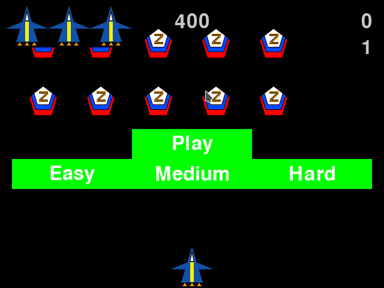
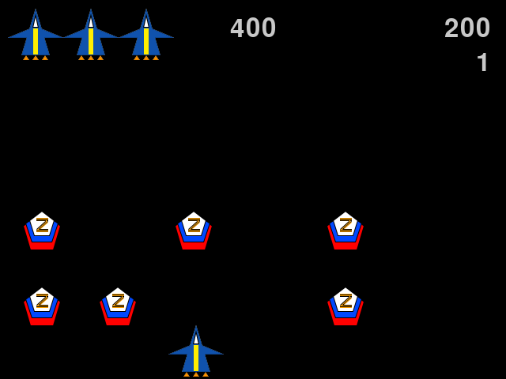

### Status
[](https://github.com/DREU007/alien_invasion/actions) [](https://codeclimate.com/github/DREU007/alien_invasion/maintainability)

### Description
Game based on the original Atari game Space Invaders. Shoot the aliens to defend the Earth and score as much as you can to beat the all-time high score.

### Installation
```
git clone https://github.com/DREU007/alien-invasion
cd alien-invasion
make install
make build
make package-install
alien-invasion
```

### Uninstallation
```
make package-remove
```

### Controls
| Keys               | Action                        |
|:-------------------|-------------------------------|
| LMB                | Select in Start Menu          |
| P                  | Start game / Play round again |
| Left / Right arrow | Move the ship                 |
| SPACE              | Shoot                         |
| Q                  | Exit the game                 |


### Dependencies
Python 3.10

### Gameplay



